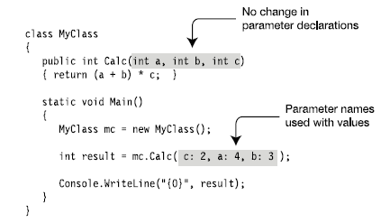

### Formal Parameters
Formal parameters are local variables that are declared in the method declaration’s parameter list,
rather than in the body of the method.

* Because formal parameters are variables, they have a data type and a name, and
they can be written to and read from.
* Unlike a method’s other local variables, the parameters are defined outside the
method body and are initialized before the method starts (except for one type,
called output parameters, which I’ll cover shortly).
*  The parameter list can have any number of formal parameter declarations, and
the declarations must be separated by commas.

### Methods and Parameter Modifiers

## The Default by Value Parameter-Passing Behavior

The default manner in which a parameter is sent into a function is by value. Simply put, if you do not
mark an argument with a parameter modifier, a copy of the data is passed into the function.
what is copied will depend on whether the parameter is a
value type or a reference type.

When you use value parameters, data is passed to the method by copying the value of the actual
parameter to the formal parameter.

Before you can use a variable as an actual parameter, that variable must be assigned a value (except
in the case of output parameters
For reference types, the variable can be assigned either an actual reference or null.

```csharp
class MyClass
    {
        public int Val = 20; // Initialize the field to 20.
    }
    class Program
    {

        static void MyMethod(MyClass f1, int f2)
        {
            f1.Val = f1.Val + 5; // Add 5 to field of f1 param.
            f2 = f2 + 5; // Add 5 to second param.
            Console.WriteLine("f1.Val: {0}, f2: {1}", f1.Val, f2);
        }

        static void Main()
        {
            MyClass a1 = new MyClass();
            int a2 = 10;
            MyMethod(a1, a2); // Call the method.
            Console.WriteLine("f1.Val: {0}, f2: {1}", a1.Val, a2);
        }

    }
 ```
 This code produces the following output:
 <p>f1.Val: 25, f2: 15</p>
 <p>f1.Val: 25, f2: 10</p>

* Before the method call, variables a1 and a2, which will be used as the actual
parameters, are already on the stack.
* By the beginning of the method, the system will have allocated space on the stack
for the formal parameters and copied the values from the actual parameters.
− Since a1 is a reference type, the reference is copied, resulting in both the
actual and formal parameters referring to the same object in the heap.
− Since a2 is a value type, the value is copied, producing an independent data
item.
* At the end of the method, both f2 and the field of object f1 have been incremented
by 5.
− After method execution, the formal parameters are popped off the stack.
− The value of a2, the value type, is unaffected by the activity in the method.
− The value of a1, the reference type, however, has been changed by the activity
in the method.

Numerical data falls under the category of value types. Therefore, if you change the values of the
parameters within the scope of the member, the caller is blissfully unaware, given that you are changing
the values on a copy of the caller’s original data.

### Reference Parameters
* When using a reference parameter, you must use the ref modifier in both the
declaration and the invocation of the method.
* The actual parameter must be a variable, and it must be assigned to before being
used as the actual parameter. If it’s a reference type variable, it can be assigned
either an actual reference or the value null.

For example, the following code shows method MyMethod again, but this time the parameters are
reference parameters rather than value parameters:

```csharp
class MyClass
{
    public int Val = 20; // Initialize field to 20.
}
 class Program 
 { 
     static void MyMethod(ref MyClass f1, ref int f2)
    {
        f1.Val = f1.Val + 5; // Add 5 to field of f1 param.
        f2 = f2 + 5; // Add 5 to second param.
        Console.WriteLine("f1.Val: {0}, f2: {1}", f1.Val, f2);
    }
    static void Main()
    {
        MyClass a1 = new MyClass();
        int a2 = 10;
    
        MyMethod(ref a1, ref a2); // Call the method.
        Console.WriteLine("f1.Val: {0}, f2: {1}", a1.Val, a2);
    }
}
```
This code produces the following output:
<p>f1.Val: 25, f2: 15</p>
<p>f1.Val: 25, f2: 15</p>

### Reference Types As Value and Reference Parameters

In the previous sections you saw that for a reference type object, you can modify its members inside the
method call, regardless of whether you send the object in as a value parameter or as a reference
parameter. We didn’t, however, assign to the formal parameter itself, inside the method. In this section
we’ll look at what happens when you assign to the formal parameter of a reference type inside the
method. The answer is the following:
* Passing a reference type object as a value parameter: If you create a new object
inside the method and assign it to the formal parameter, it breaks the connection
between the formal parameter and the actual parameter, and the new object does
not persist after the method call.
* Passing a reference type object as a reference parameter: If you create a new object
inside the method and assign it to the formal parameter, that new object persists
after the method is ended, and is the value referenced by the actual parameter.
The following code shows the first case—using a reference type object as a value parameter:
```csharp
class MyClass { public int Val = 20; }
class Program
{
    static void RefAsParameter( MyClass f1 )
    {
        f1.Val = 50;
        Console.WriteLine( "After member assignment: {0}", f1.Val );
        f1 = new MyClass();
        Console.WriteLine( "After new object creation: {0}", f1.Val );
    }
    static void Main( )
    {
        MyClass a1 = new MyClass();
        Console.WriteLine( "Before method call: {0}", a1.Val );
        RefAsParameter( a1 );
        Console.WriteLine( "After method call: {0}", a1.Val );
    }
}
```
This code produces the following output:
<p>Before method call: 20</p>
<p>After member assignment: 50</p>
<p>After new object creation: 20</p>
<p>After method call: 50</p>

* At the beginning of the method, both the actual parameter and the formal
parameter point to the same object in the heap.
* After the assignment to the object’s member, they still point at the same object in
the heap.
* When the method allocates a new object and assigns it to the formal parameter,
the actual parameter (outside the method) still points at the original object, and
the formal parameter points at the new object.
* After the method call, the actual parameter points to the original object, and the
formal parameter and new object are gone.

The following code illustrates the case where a reference type object is used as a reference
parameter. The code is exactly the same except for the ref keyword in the method declaration and the
method invocation.
```csharp
class MyClass
{
    public int Val = 20;
}
class Program
{
    static void RefAsParameter( ref MyClass f1 )
    {
        // Assign to the object member.
        f1.Val = 50;
        Console.WriteLine( "After member assignment: {0}", f1.Val );
        // Create a new object and assign it to the formal parameter.
        f1 = new MyClass();
        Console.WriteLine( "After new object creation: {0}", f1.Val );
    }
    static void Main( string[] args )
    {
        MyClass a1 = new MyClass();
        Console.WriteLine( "Before method call: {0}", a1.Val );
        RefAsParameter( ref a1 );
        Console.WriteLine( "After method call: {0}", a1.Val );
    }
}
```
This code produces the following output:
<p>Before method call: 20</p>
<p>After member assignment: 50</p>
<p>After new object creation: 20</p>
<p>After method call: 20</p>

* When the method is invoked, the formal and actual parameters point at the same
object in the heap.
* The modification of the member value is seen by both the formal and actual
parameter.
* When the method creates a new object and assigns it to the formal parameter, the
references of both the formal and actual parameters point to the new object.
* After the method, the actual parameter is left pointing at the object that was
created inside the method.

### The out Modifier

Next, you have the use of output parameters. Methods that have been defined to take output parameters
(via the out keyword) are under obligation to assign them to an appropriate value before exiting the
method scope (if you fail to do so, you will receive compiler errors).
To illustrate, here is an alternative version of the Add() method that returns the sum of two integers
using the C# out modifier (note the physical return value of this method is now void).

Calling a method with output parameters also requires the use of the out modifier. However, the
local variables that are passed as output variables are not required to be assigned before passing them in
as output arguments (if you do so, the original value is lost after the call). The reason the compiler allows
you to send in seemingly unassigned data is due to the fact that the method being called must make an
assignment. The following code is an example:
```csharp
static void Main(string[] args)
{
    Console.WriteLine("***** Fun with Methods *****");
    ...
    // No need to assign initial value to local variables
    // used as output parameters, provided the first time
    // you use them is as output arguments.
    int ans;
    Add(90, 90, out ans);
    Console.WriteLine("90 + 90 = {0}", ans);
    Console.ReadLine();
}
```
The previous example is intended to be illustrative in nature; you really have no reason to return the
value of your summation using an output parameter. However, the C# out modifier does serve a very
useful purpose: it allows the caller to obtain multiple outputs from a single method invocation.
```csharp
// Returning multiple output parameters.
static void FillTheseValues(out int a, out string b, out bool c)
{
    a = 9;
    b = "Enjoy your string.";
    c = true;
}
```
The caller would be able to invoke the FillTheseValues() method. Remember that you must use the
out modifier when you invoke the method, as well as when you implement the method:
```csharp
static void Main(string[] args)
{
    Console.WriteLine("***** Fun with Methods *****");
    ...
    int i; string str; bool b;
    FillTheseValues(out i, out str, out b);
    Console.WriteLine("Int is: {0}", i);
    Console.WriteLine("String is: {0}", str);
    Console.WriteLine("Boolean is: {0}", b);
    Console.ReadLine();
}
```
Finally, always remember that a method that defines output parameters must assign the parameter
to a valid value before exiting the method scope. Therefore, the following code will result in a compiler
error, as the output parameter has not been assigned within the method scope:
```csharp
static void ThisWontCompile(out int a)
{
    Console.WriteLine("Error! Forgot to assign output arg!");
}
```
### Parameter Arrays

In the parameter types I’ve covered so far, there must be exactly one actual parameter for each formal
parameter. Parameter arrays are different in that they allow zero or more actual parameters of a
particular type for a particular formal parameter. Important points about parameter arrays are the
following:
* There can be only one parameter array in a parameter list.
* If there is one, it must be the last parameter in the list.
* All the parameters represented by the parameter array must be of the same type.
To declare a parameter array, you must do the following:
* Use the params modifier before the data type.
* Place a set of empty square brackets after the data type.

To clear things up, assume you wish to create a
function that allows the caller to pass in any number of arguments and return the calculated average.
If you were to prototype this method to take an array of doubles, this would force the caller to first
define the array, then fill the array, and finally pass it into the method. However, if you define
CalculateAverage() to take a params of double[] data types, the caller can simply pass a commadelimited
list of doubles. The .NET runtime will automatically package the set of doubles into an array of
type double behind the scenes:
```csharp
// Return average of "some number" of doubles.
static double CalculateAverage(params double[] values)
{
    Console.WriteLine("You sent me {0} doubles.", values.Length);
    double sum = 0;
    if(values.Length == 0)
    return sum;
    for (int i = 0; i < values.Length; i++)
    sum += values[i];
    return (sum / values.Length);
}
```
This method has been defined to take a parameter array of doubles. What this method is in fact
saying is, “Send me any number of doubles (including zero) and I’ll compute the average.” Given this,
you can call CalculateAverage() in any of the following ways:
```csharp
static void Main(string[] args)
{
    Console.WriteLine("***** Fun with Methods *****");
...
// Pass in a comma-delimited list of doubles...
    double average;
    average = CalculateAverage(4.0, 3.2, 5.7, 64.22, 87.2);
    Console.WriteLine("Average of data is: {0}", average);
    // ...or pass an array of doubles.
    double[] data = { 4.0, 3.2, 5.7 };
    average = CalculateAverage(data);
    Console.WriteLine("Average of data is: {0}", average);
    // Average of 0 is 0!
    Console.WriteLine("Average of data is: {0}", CalculateAverage());
    Console.ReadLine();
}
```
If you did not make use of the params modifier in the definition of CalculateAverage(), the first
invocation of this method would result in a compiler error, as the compiler would be looking for a
version of CalculateAverage() that took five double arguments.
To avoid any ambiguity, C# demands a method only support single params argument, which must be the
final argument in the parameter list.
This technique is nothing more than a convenience for the caller, given that the
array is created by the CLR as necessary. By the time the array is within the scope of the method being
called, you are able to treat it as a full-blown .NET array that contains all the functionality of the
System.Array base class library type. Consider the following output:
<p>You sent me 5 doubles.</p>
<p>Average of data is: 32.864</p>
<p>You sent me 3 doubles.</p>
<p>Average of data is: 4.3</p>
<p>You sent me 0 doubles.</p>
<p>Average of data is: 0</p>

### Defining Optional Parameters

C# allows you to create methods that can take optional arguments. This technique allows the caller to
invoke a single method while omitting arguments deemed unnecessary, provided the caller is happy
with the specified defaults.
To illustrate working with optional arguments, assume you have a method named EnterLogData(),
which defines a single optional parameter:
```csharp
static void EnterLogData(string message, string owner = "Programmer")
{
    Console.Beep();
    Console.WriteLine("Error: {0}", message);
    Console.WriteLine("Owner of Error: {0}", owner);
}
```
Here, the final string argument has been assigned the default value of "Programmer", via an
assignment within the parameter definition. Given this, we can call EnterLogData() from within Main()
in two manners:
```csharp
static void Main(string[] args)
{
    Console.WriteLine("***** Fun with Methods *****");
    ...
    EnterLogData("Oh no! Grid can't find data");
    EnterLogData("Oh no! I can't find the payroll data", "CFO");
    Console.ReadLine();
}
```
Because the first invocation of EnterLogData() did not specify a second string argument, we would
find that the programmer is the one responsible for losing data for the grid, while the CFO misplaced the
payroll data (as specified by the second argument in the second method call).
One very important thing to be aware of, is that the value assigned to an optional parameter must be
known at compile time, and cannot be resolved at runtime (if you attempt to do so, you’ll receive
compile-time errors!). To illustrate, assume you wish to update EnterLogData() with the following extra
optional parameter:
```csharp
// Error! The default value for an optional arg must be known
// at compile time!
static void EnterLogData(string message,
string owner = "Programmer", DateTime timeStamp = DateTime.Now)
{
    Console.Beep();
    Console.WriteLine("Error: {0}", message);
    Console.WriteLine("Owner of Error: {0}", owner);
    Console.WriteLine("Time of Error: {0}", timeStamp);
}
```
<p>This will not compile, as the value of the Now property of the DateTime class is resolved at runtime,
not compile time. </p>
<p>To avoid ambiguity, optional parameters must always be packed onto the end of a method signature. It is
a compiler error to have optional parameters listed before nonoptional parameters.</p>

### Named Parameters

So far in our discussion of parameters we’ve used positional parameters, which, as you’ll remember,
means that the position of each actual parameter matches the position of the corresponding formal
parameter.
Alternatively, C# allows you to use named parameters. Named parameters allow you to list the
actual parameters in your method invocation in any order, as long as you explicitly specify the names of
the parameters. The details are the following:
* Nothing changes in the declaration of the method. The formal parameters already
have names.
* In the method invocation, however, you use the formal parameter name, followed
by a colon, in front of the actual parameter value or expression, as shown in the
following method invocation. Here a, b, and c are the names of the three formal
parameters of method Calc:




